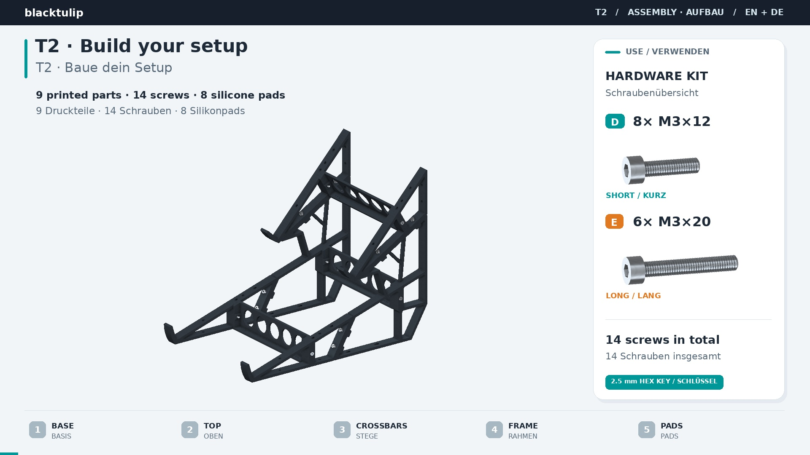
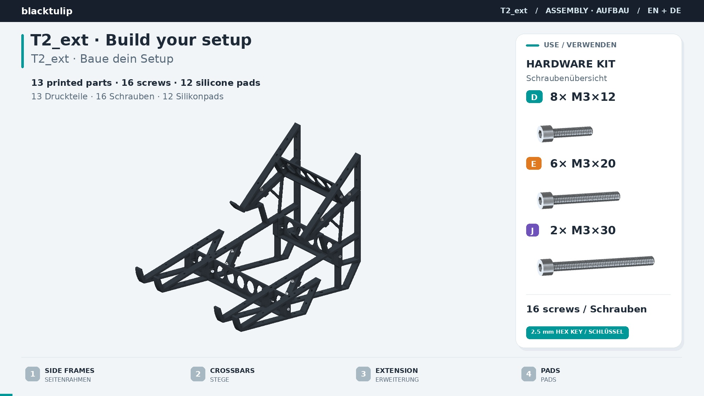
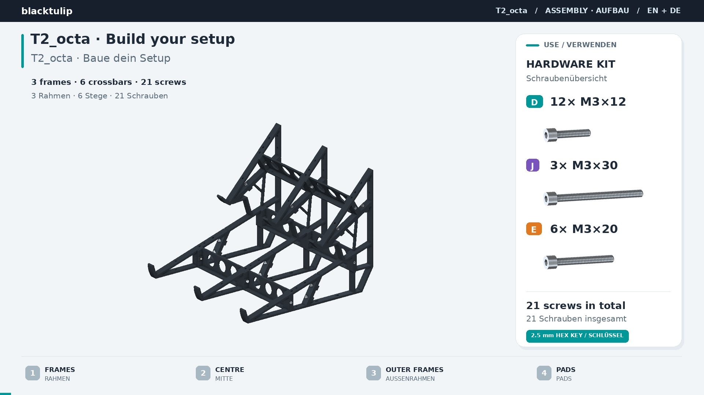

# b1-Assembly
Stand Assembly

Assembly Guide [T2 (PDF, EN / DE)](T2/) · [▶ Video (YouTube)](https://youtu.be/pwy1H-LJLqM)

Assembly Guide [T2_ext (PDF, EN / DE)](T2_ext/) · [▶ Video (YouTube)](https://youtu.be/cbUp3tmoaho)

Assembly Guide [T2_octa (PDF, EN / DE)](T2_octa/) · [▶ Video (YouTube)](https://youtu.be/Rk0xiEEh7rw)

[Measurement-Tutorial](Measurement-Tutorial-FeltProtect/Measurement-Tutorial-FeltProtect.md)

[Kryptex - Coding instructions](Kryptex/Kryptex_coding.md)

## T2 - Assembly instructions / Aufbauanleitung

[Open the T2 folder / T2-Ordner öffnen](T2/)

[Download the EN / DE assembly instructions (PDF, version 1.0)](T2/T2_Assembly_EN_DE.pdf)

One A4 page, English first with German below. Print at 100% / actual size.

Eine A4-Seite, Englisch mit deutscher Übersetzung. Mit 100 % / tatsächlicher Größe drucken.

[▶ Watch on YouTube / Auf YouTube ansehen (EN / DE, 68 s)](https://youtu.be/pwy1H-LJLqM)

Full HD, English and German on-screen instructions, animated screws and hex key. No audio.

Full HD, deutsche und englische Texte, animierte Schrauben und Innensechskantschlüssel. Ohne Ton.

## T2_ext - Assembly instructions / Aufbauanleitung

[Open the T2_ext folder / T2_ext-Ordner öffnen](T2_ext/)

[Download the EN / DE assembly instructions (PDF, version 1.4)](T2_ext/T2_ext_Assembly_EN_DE.pdf)

One A4 page, English first with German below. Print at 100% / actual size.

Eine A4-Seite, Englisch mit deutscher Übersetzung. Mit 100 % / tatsächlicher Größe drucken.

[▶ Watch on YouTube / Auf YouTube ansehen (EN / DE, 86 s)](https://youtu.be/cbUp3tmoaho)

Full HD, English and German on-screen instructions, including the lower extension and screw selection. No audio.

Full HD, deutsche und englische Texte, einschließlich unterer Erweiterung und Schraubenauswahl. Ohne Ton.

## T2_octa - Assembly instructions / Aufbauanleitung

[Open the T2_octa folder / T2_octa-Ordner öffnen](T2_octa/)

[Download the EN / DE assembly instructions (PDF, version 1.3)](T2_octa/T2_octa_Assembly_EN_DE.pdf)

One A4 page, English first with German below. Print at 100% / actual size.

Eine A4-Seite, Englisch mit deutscher Übersetzung. Mit 100 % / tatsächlicher Größe drucken.

[▶ Watch on YouTube / Auf YouTube ansehen (EN / DE, 99 s)](https://youtu.be/Rk0xiEEh7rw)

Full HD, English and German on-screen instructions, including a cutaway of the 135 mm crossbar connection. No audio.

Full HD, deutsche und englische Texte, einschließlich Schnittansicht der 135-mm-Stegverbindung. Ohne Ton.
