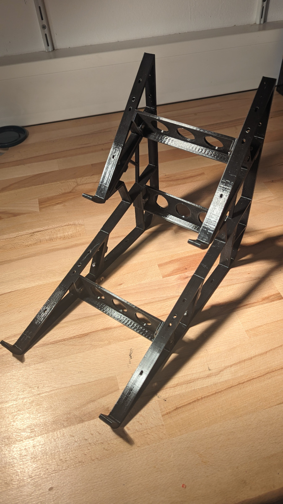

# Ausbauanleitung T2 #
## Material ##

Anleitung dazu findet ihr hier. 

https://youtu.be/INyY0__D8Ug

| Schraube | M3x12 | M3x20 | Pads | 
| :---:   | :---: | :---: | :---: |
| Anzahl  | 8 | 6  |  8 |

Sind im Lieferumfang vorhanden.

## Werkzeug ## 
- Imbusschlüssel 2,5mm 

## Aufbauanleitung: ##

**Positionierung der Stege:**
- Achte darauf, dass die Stege so eingebaut werden, dass die schrägen Kanten oben sind und sich somit in der Flucht der Seitenteile befinden. (**Position G**)

**Anziehen der Schrauben:**
- Ziehe  die Schrauben nur handfest an, um eine angemessene Stabilität zu gewährleisten.

**Verwendung der Schrauben:**
- Alle Schrauben, die seitlich verwendet werden, also horizontal, um nur zwei Teile zu verbinden, sollten M3x20 Schrauben sein. (**Position A**)

Alle Schrauben von **oben** und **hinten** sind M3x12. Für den Imbusschlüssel gibt es vorgefertigte Löcher durch das ganze Bauteil.  (**Position B und D**)

